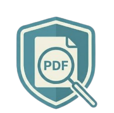

# LexSentinel - Raio-X PDF

<p align="center">
  
</p>

<p align="center">
  <strong>Análise defensiva de PDFs para identificação de conteúdo oculto, estruturas suspeitas e vetores de manipulação documental.</strong>
</p>

<p align="center">
  Ferramenta desktop voltada à triagem técnica preliminar de documentos PDF com foco jurídico, forense e segurança documental.
</p>

---

## Visão geral

O **LexSentinel - Raio-X PDF** é uma ferramenta desktop criada para inspeção defensiva de documentos PDF.

Seu objetivo é auxiliar na identificação de artefatos potencialmente capazes de:

- ocultar conteúdo relevante;
- manipular interpretação automatizada de documentos;
- incorporar elementos ativos ou suspeitos;
- introduzir vetores de prompt injection;
- mascarar comandos ou instruções invisíveis.

A ferramenta combina abordagem **forense documental**, **segurança aplicada** e **análise técnica orientada ao contexto jurídico**.

---

## Funcionalidades

### Análise técnica automatizada

Detecção de:

✅ Prompt injection textual  
✅ Texto oculto / invisível  
✅ JavaScript embarcado  
✅ OpenAction (ações automáticas ao abrir)  
✅ Arquivos incorporados  
✅ Metadados suspeitos  
✅ Estruturas PDF anômalas  
✅ Camadas opcionais / conteúdo ocultável  
✅ Extração integral de texto puro  

---

### Classificação preliminar de risco

O documento recebe classificação automatizada:

- 🟢 Baixo risco
- 🟡 Suspeito
- 🟠 Alto risco
- 🔴 Crítico

Com score técnico cumulativo.

---

### Relatórios técnicos

Geração de relatórios em:

- HTML
- PDF
- JSON

Incluindo:

- resumo executivo;
- fingerprint documental;
- explicação técnica dos achados;
- evidências visuais;
- ambiente técnico;
- metodologia aplicada;
- transparência metodológica.

---

### Sanitização defensiva

Permite neutralização de artefatos potencialmente ativos ou maliciosos.

Inclui sanitização agressiva para cenários de contenção e inspeção defensiva.

---

### Extração de texto puro

Permite visualizar exatamente o conteúdo textual efetivamente extraído do documento.

Útil para detectar:

- texto invisível;
- comandos ocultos;
- payloads documentais;
- instruções adversariais.

---

# Capturas de tela

## Interface principal


---

## Relatório técnico


---

## Exemplo de achado técnico


---

# Instalação (Linux)

Baixe o AppImage na aba **Releases**.

Depois:

```bash
chmod +x LexSentinel.AppImage
./LexSentinel.AppImage
```

---

# Execução a partir do código-fonte

```bash
git clone https://github.com/SEU-USUARIO/lexsentinel.git
cd lexsentinel

python -m venv .venv
source .venv/bin/activate

pip install -e .
lexsentinel-gui
```

---

# Público-alvo

Especialmente útil para:

- advogados;
- peritos;
- analistas forenses;
- profissionais de compliance;
- pesquisadores de segurança;
- equipes de segurança documental.

---

# Aviso importante

O LexSentinel realiza **triagem técnica preliminar automatizada**.

Não substitui:

- perícia forense completa;
- auditoria especializada;
- análise humana contextual;
- validação pericial formal.

Os resultados devem ser interpretados tecnicamente.

---

# Estado do projeto

**Release Candidate / Beta**

Projeto em evolução ativa.

Roadmap:

- refinamento de sanitização;
- melhorias de UX;
- novas heurísticas;
- maior granularidade de explicações;
- expansão da análise estrutural.

---

# Licença

MIT
